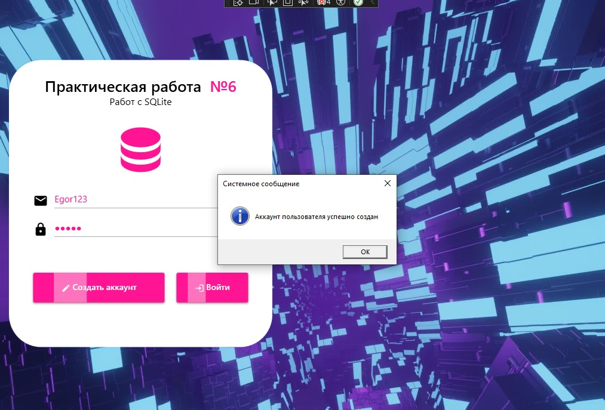

<h1>Задание 6. Использование EntityFrameworkCore и SQLite</h1>

<h3>Технологии проекта:</h3>
<ul>
    <li>Entity Framework Core - для работы с базой данных</li>
    <li>SQLite - в качестве легковесной СУБД</li>
</ul>

<h3>Основной функционал:</h3>
<ul>
    <li>Регистрация новых пользователей</li>
    <li>Авторизация в системе</li>
    <li>Управление ролями пользователей</li>
</ul>

<h3>Запуск приложения:</h3>
<ol>
    <li>Запустить исполняемый файл: Task6SQLite.exe</li>
</ol>

<h3>Скриншоты интерфейса:</h3>
<table border="0" cellspacing="10">
    <tr>
        <td></td>
        <td></td>
    </tr>
    <tr>
        <td align="center">Форма регистрации</td>
        <td align="center">Форма входа с выбором роли</td>
    </tr>
</table>
